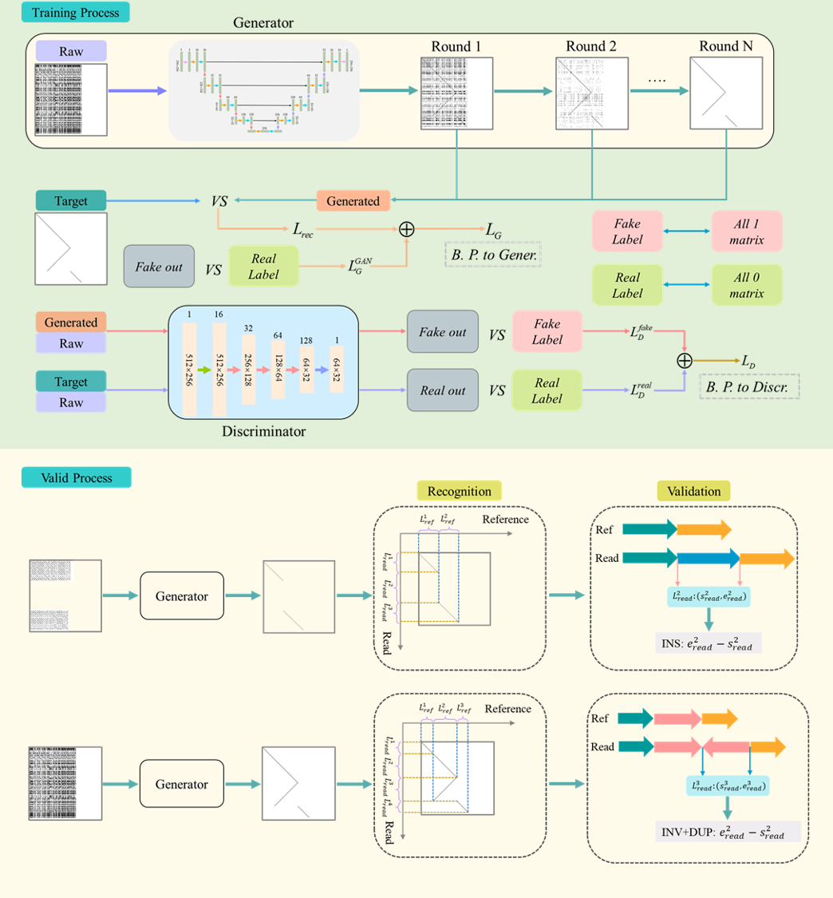

# 2025-Kefaz-SValidation
## SValidation: A Generative Model-Based Framework for Structural Variant Validation via Genomic Image Representations

SValidation is a deep learning-based framework designed to validate structural variants (SVs) detected from long-read sequencing data. It leverages genomic image representation and applies a Conditional Generative Adversarial Network (CGAN) to denoise repetitive background patterns. By enhancing true structural features and effectively removing noise caused by highly repetitive genomic regions, SValidation enables more accurate SV boundary localization and classification. 


<p align="center">
  
</p>


# 🛠 Installation

## ✅ Supported Platforms

- Ubuntu (including WSL)
- CentOS

## 📦 From Source

```bash
# Clone the repository
git clone https://github.com/xjtu-omics/2025-kefaz-SValidation.git
cd 2025-kefaz-SValidation

# Create conda environment and install dependencies
conda env create -f environment.yml
conda activate sv-validation
python setup.py install
```

# 🚀 Usage

### Required Input/Ouput parameters

To run SV validation with default settings, you only need to provide:

- `--bam_path`: the aligned BAM file
- `--vcf_path`: the structural variant file (VCF)
- `--ref_path`: the reference genome (FASTA)
- `--out_path`: the directory to save validation results
- `--threads`: number of threads to use

### Run Example

```bash
python ./SValidation/Valid_matrix.py \
  --bam_path /path/to/your.bam \
  --vcf_path /path/to/your.vcf \
  --ref_path /path/to/your.fasta \
  --out_path /path/to/output_dir \
  --threads 8
```
